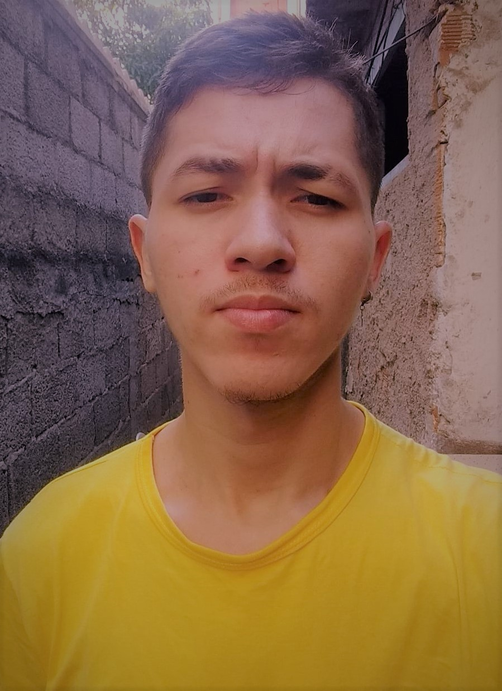

# Formulário Mentoria
Desafio do programa Explorer da Rocketseat. Recriação de um formulário com todos os conhecimentos passados nas aulas de HTML e CSS.

## Demo

### Autor
---

<a href="#">
 
  
 
Lucas Alves
</a>
 
 

